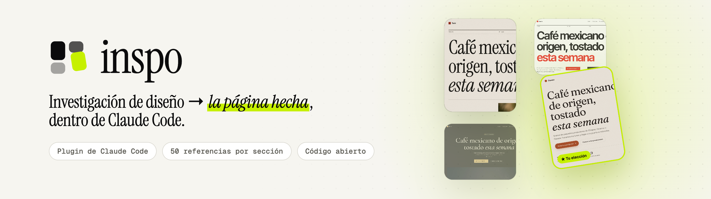
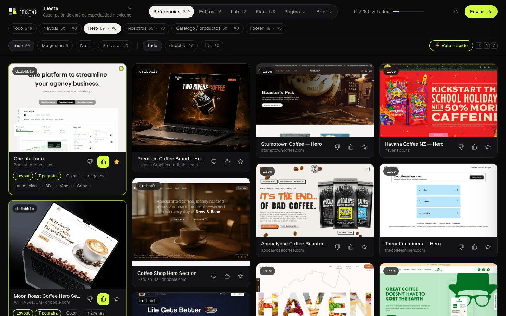
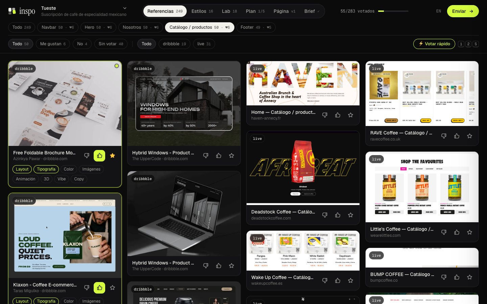
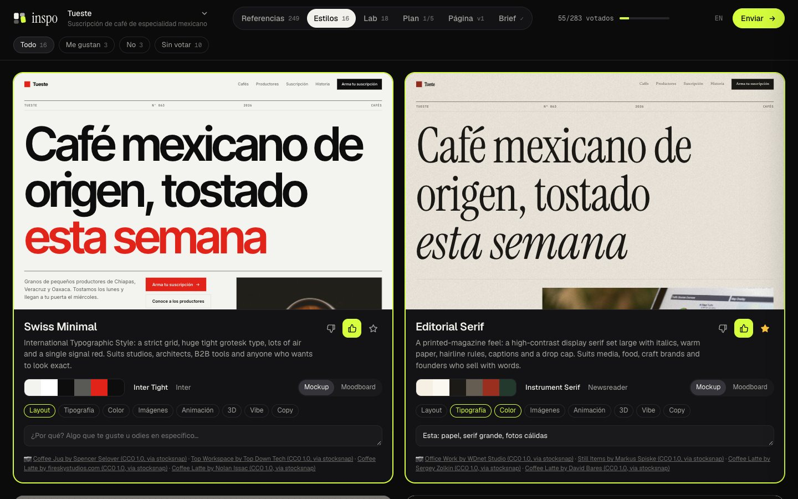
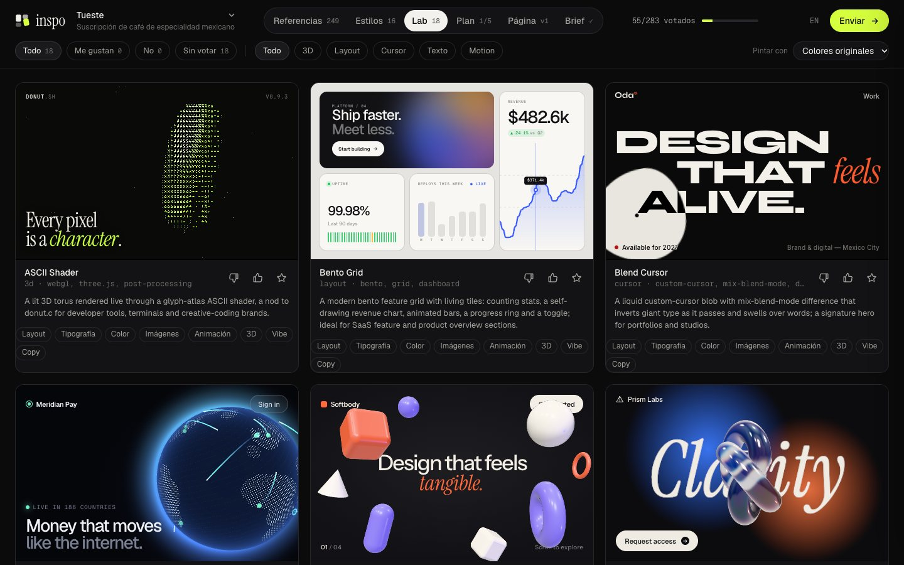
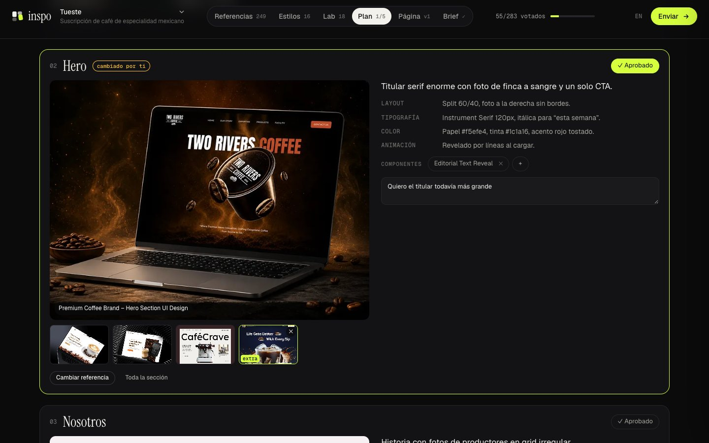
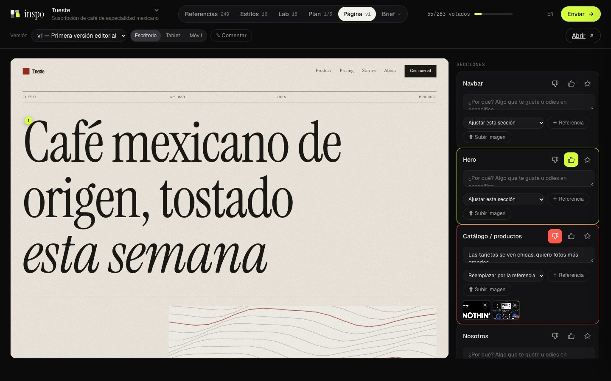
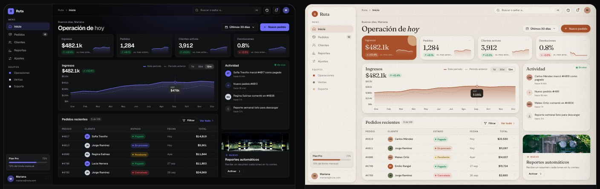
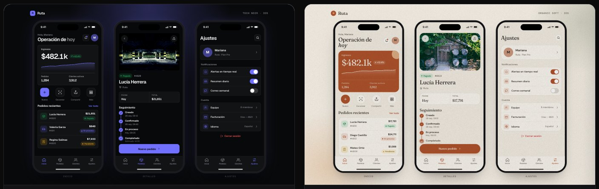
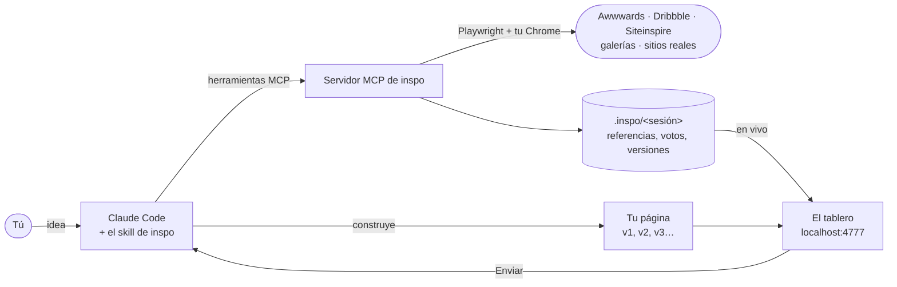

<div align="center">

[English](README.md) · **Español**

<picture>
  <source media="(prefers-color-scheme: dark)" srcset="docs/es/banner-dark.png">
  
</picture>

<br>

**Le cuentas tu idea a Claude. inspo junta unas 50 referencias para cada sección de tu página,
la dibuja en varios estilos con fotos reales, te abre un tablero donde votas todo, y luego
construye la página.**<br>
Para páginas web, sistemas web y apps móviles. Código abierto, y corre en tu máquina.

<br>

[](https://github.com/brunovareliuu/inspo/actions/workflows/ci.yml)
[](LICENSE)
[](#instalación)
[](#herramientas)
[](package.json)
[](https://playwright.dev)

[**Instálalo en 30 segundos**](#instalación) · [Cómo se usa](#cómo-se-usa) · [Qué hace](#qué-hace) · [Herramientas](#herramientas) · [Cómo está hecho](#cómo-está-hecho) · [Contribuir](CONTRIBUTING.md)

<br>



</div>

## Por qué inspo

<table>
<tr>
<td width="50%" valign="top">

**Referencias de tu giro.** Un restaurante recibe comida. Unas 40 de cada 50 referencias son
de tu giro, y las otras 10 vienen de cualquier lado, para ideas que no habrías buscado.

</td>
<td width="50%" valign="top">

**Sitios reales, recortados en secciones.** Visita sitios premiados, cierra los banners de
cookies, encuentra el hero, el catálogo o el footer, y captura solo esa parte. Comparas footers
con footers.

</td>
</tr>
<tr>
<td valign="top">

**Votas en vez de describir.** 👍, 👎 o ★ en cada referencia, estilo y componente, más el *por
qué* (layout, tipografía, color, animación…). Claude lee tus votos y las imágenes que te
gustaron.

</td>
<td valign="top">

**Termina en una página.** Claude construye la página con tus votos, y sigues comentando
sección por sección hasta que quede. v1, v2, v3… todo en el mismo tablero.

</td>
</tr>
</table>

```
/inspo suscripción de café mexicano de especialidad, tostado cada semana
```

## Qué hace

<table>
<tr>
<td colspan="2" valign="top">

### 50+ referencias por sección
Una cosecha en segundo plano llena cada sección que necesites (19 tipos: navbar, hero, logos,
features, servicios, catálogo, proyectos, nosotros, proceso, números, equipo, testimonios,
precios, FAQ, blog, CTA, newsletter, contacto, footer) con **galerías dedicadas**
(footer.design, navbar.gallery), **Dribbble** y **sitios reales recortados en secciones**:
visita cientos de ganadores de Awwwards y Siteinspire, quita banners de cookies y popups de
descuento, y sigue las ligas a /about, /shop o /pricing cuando la sección tiene su propia
página. Unas 250 referencias en 5 secciones tardan como 6 minutos, y el tablero se va llenando
en vivo.



</td>
</tr>
<tr>
<td width="50%" valign="top">

### Estilos
Tu propia landing, con tu copy, en 4–6 direcciones distintas. Cada una trae su paleta, fuentes
de Google Fonts, layout, textura y fotos CC0 reales. Incluye 16 presets, y Claude los ajusta o
inventa nuevos.



</td>
<td width="50%" valign="top">

### Lab
18 componentes en vivo de nivel producción (shaders WebGL, globo de puntos, nudo de vidrio,
galaxias de partículas, stacks con scroll, botones magnéticos…) más los que Claude escribe
para tu idea. Los repintas todos con un estilo que te gustó.



</td>
</tr>
<tr>
<td colspan="2" valign="top">

### Plan
Después de votar, Claude analiza tus favoritos y escribe el plan de cada sección: la
referencia principal, alternativas y qué se toma de layout, tipografía, color, imágenes y
animación, más los componentes. Cambias la referencia por cualquiera de tus likes, cambias el
estilo, dejas notas y apruebas. Claude construye con ese plan.



</td>
</tr>
<tr>
<td colspan="2" valign="top">

### La página
Claude la construye con tus votos y la publica en la pestaña **Página**, en escritorio, tablet
y móvil. Votas y dejas notas por sección, o activas **Comentar** y le das clic a lo que quieras
para fijar una nota. Cualquier comentario puede llevar una referencia (de tus imágenes o una
que subas) y una acción: *ajustar*, *reemplazar esta sección por la referencia*, *agregar
arriba* o *agregar abajo*. Claude ve las imágenes, aplica cada acción y publica la v2, v3…



</td>
</tr>
<tr>
<td width="50%" valign="top">

### Reporte en PDF
Un entregable con acabado de estudio: portada, dirección, los ganadores de cada sección con
tus notas, estilos, componentes y la página actual.


</td>
<td width="50%" valign="top">

### El tablero
👍 / 👎 / ★ sección por sección, etiquetas de *por qué*, notas y **Enviar**. **⚡ Votar rápido**
va una por una con `1` / `2` / `S`, y **✕ No es footer** (tecla `X`) quita para siempre lo que
no va. Se guarda solo y está en español o inglés.

Claude además revisa cada sección en hojas de contacto numeradas, quita lo que no va y rellena,
así cada sección solo tiene esa sección.

</td>
</tr>
</table>

### Páginas web, sistemas web y apps

inspo se adapta a lo que estás haciendo:

| Estás haciendo | Investiga | Los estilos se ven como | Claude construye |
|---|---|---|---|
| **Página web** (landing, tienda, portafolio) | Secciones: navbar, hero, nosotros, catálogo, precios, testimonios, footer… | Tu landing | Una página responsive |
| **Sistema web** (SaaS, dashboard, admin, herramienta interna) | Pantallas: login, onboarding, dashboard, menú lateral, tablas, detalle, formularios, configuración, pagos, estados vacíos… | Un dashboard con tus datos | Un prototipo navegable |
| **App móvil** (iOS / Android) | Pantallas: onboarding, login, inicio, tab bar, feed, detalle, búsqueda, perfil, checkout… | Tres pantallas de teléfono | Pantallas tamaño teléfono |




Las pantallas de apps salen de SaaS Interface (productos reales como Grafana, Ahrefs,
Mixpanel, Qonto), de Dribbble filtrado por plataforma (nada de pantallas móviles en un sistema
web, ni al revés) y de Mobbin si inicias sesión una vez.

## Instalación

En Claude Code:

```
/plugin marketplace add brunovareliuu/inspo
/plugin install inspo@inspo
```

Eso instala la skill `inspo` (el flujo) y el servidor MCP `inspo` (las herramientas). El servidor instala sus dependencias solo la primera vez que arranca. Usa tu Google Chrome; si no tienes Chrome, corre `npx playwright install chromium`.

Necesitas Node 20 o superior.

<details>
<summary>Otros clientes MCP (Cursor, Claude Desktop, Windsurf…)</summary>

```bash
git clone https://github.com/brunovareliuu/inspo ~/inspo && cd ~/inspo && npm install
```

```json
{
  "mcpServers": {
    "inspo": { "command": "node", "args": ["/ruta/absoluta/a/inspo/src/server.js"] }
  }
}
```

Las herramientas funcionan en cualquier cliente. El flujo vive en [`skills/inspo/SKILL.md`](skills/inspo/SKILL.md); pégalo en las reglas o instrucciones de proyecto de tu cliente.
</details>

## Cómo se usa

Solo describe lo que estás haciendo. La skill se activa sola, o la llamas con `/inspo`:

```
/inspo portafolio para un despacho de arquitectura en Monterrey, muy minimalista
/inspo rediseña esta app, parece plantilla
/inspo landing para mi app de notas con IA, me encantan linear.app y stripe.com
```

La conversación:

1. **La idea.** Claude te dice lo que entendió y pregunta solo lo que falta: público, qué debe transmitir, sitios que te gustan, marca. Si hay repo o app corriendo, los revisa.
2. **Secciones.** Te pregunta qué secciones necesita la página.
3. **Recomendación.** Propone una lista de secciones para tu tipo de página, con el porqué de cada una, y tú la ajustas.
4. **Investigación y votos.** Cosecha de unas 50 referencias por sección, 4–6 estilos y componentes en vivo, todo en el tablero. Votas y le das **Enviar**. Claude resume lo que elegiste por sección, publica el brief y exporta el **PDF**.
5. **La página.** Claude la construye con tus votos (estilo, referencias por sección, componentes, tu copy) y la publica en la pestaña **Página**.
6. **Ciclo de feedback.** Votas y comentas sección por sección, y Claude la rehace. Se repite hasta que quede, y luego se integra a tu stack.

Todo lo de un proyecto vive en `<proyecto>/.inspo/<sesión>/`, que se ignora en git automáticamente.

## Herramientas

| Herramienta | Qué hace |
|---|---|
| `inspo_start` | Sesión nueva: idea, contexto, copy real y secciones |
| `inspo_sections` | Catálogo de secciones y sets recomendados por tipo de página, o fija el plan |
| `inspo_harvest` | Cosecha en segundo plano de N referencias por sección (50 por defecto) |
| `inspo_status` | Progreso de la cosecha por sección (o cancelarla) |
| `inspo_review` | Hojas de contacto numeradas de una sección para que Claude verifique cada imagen |
| `inspo_plan` | Publica el plan por sección (referencia, alternativas, análisis, componentes) en la pestaña Plan |
| `inspo_search` | Busca en galerías, guarda miniaturas y opcionalmente captura los sitios en vivo |
| `inspo_capture` | Captura y analiza URLs específicas (fuentes, colores, tecnología) |
| `inspo_analyze` | Ve cualquier URL, incluido `localhost`, y regresa captura y ADN de diseño |
| `inspo_add_styles` | Dibuja tu página en direcciones de estilo con fotos reales |
| `inspo_add_component` | Agrega un componente propio al Lab |
| `inspo_add_images` | Agrega un set de imágenes de moodboard (Openverse, con licencia CC) |
| `inspo_open` | Abre el tablero |
| `inspo_feedback` | Votos por sección, estilos, componentes y feedback de la página (votos por sección y comentarios fijados), con miniaturas; puede esperar a **Enviar** |
| `inspo_add_build` | Publica una versión de la página (html, un archivo o una URL) en la pestaña Página |
| `inspo_export_pdf` | Exporta el reporte de investigación en PDF |
| `inspo_next_round` | Empieza la ronda N |
| `inspo_brief` | Publica la dirección final y la escribe en `DESIGN.md` |
| `inspo_remove` | Quita lo que no va |
| `inspo_catalog` | Lista fuentes, presets y componentes |
| `inspo_login` | Inicia sesión en Mobbin una vez, en una ventana visible |

## Fuentes

| Fuente | Sirve para | Notas |
|---|---|---|
| Awwwards | Sitios premiados con mucha animación | Liga al sitio en vivo |
| Dribbble | Estilos visuales, conceptos de UI, renders 3D | |
| Land-book | Estructura de landings completas | Capturas largas |
| Siteinspire | Tipografía, sobriedad, estudios | Liga al sitio en vivo |
| One Page Love | One-pagers y lanzamientos | |
| Lapa Ninja | Landings de SaaS y startups | |
| Mobbin | Pantallas y flujos reales de apps | Necesita cuenta de Mobbin: `inspo_login` |
| SaaS Interface | Pantallas reales de SaaS por tipo (dashboard, tablas, configuración, login…) | Fuente de la cosecha para pantallas de sistemas web |
| maxibestof | Secciones de sitios por tipo (hero, header, features, testimonios, FAQ, footer…) | Fuente de la cosecha para secciones |
| Collect UI | Más de 150 categorías de UI (dashboard, sign up, checkout, configuración, precios, footer…) | Fuente de la cosecha para secciones y pantallas, web y móvil |
| Nicelydone | Pantallas reales de SaaS (sign up, onboarding, dashboard, tablas, pagos…) | Fuente de la cosecha para pantallas de sistemas web |
| CSS Design Awards · Web Design Inspiration · Dark Mode Design | Sitios premiados y curados en vivo | Alimentan los recortes de sitios reales |
| Behance | Casos de UI de producto y branding | A la carta con `inspo_search` |
| footer.design | Solo footers | Fuente de la cosecha para `footer` |
| Navbar Gallery | Solo navbars | Fuente de la cosecha para `navbar` |
| Sitios en vivo | Todas las secciones, recortadas de sitios reales | Categorías y búsqueda de Awwwards, Siteinspire, Sites of the Day y los sitios que elige Claude |
| Openverse | Fotos para estilos y moodboards | Licencia CC y créditos, sin API key. Prioriza el stock CC0 de StockSnap |

Las galerías cambian su HTML. Si una se rompe, `node bin/inspo.js doctor` te dice cuál, y casi siempre se arregla con un PR de dos líneas en `src/sources/index.js`.

## Estilos incluidos

Swiss Minimal, Editorial Serif, Neo-Brutalist, Dark Luxury, Aurora Glass, Tech Noir, Y2K Chrome, Organic Soft, Synthwave Retro-future, Playful Pop, Terminal Mono, Architectural Monochrome, Wabi-Sabi Zen, Gradient SaaS, Bauhaus Geometric y Magazine Maximalist. Cada uno se puede ajustar (paleta, fuentes, layout, textura, tratamiento de imagen), y Claude también puede pasar HTML totalmente propio. Los detalles están en el [README en inglés](README.md#style-presets).

## Componentes

Liquid Blob, Particle Galaxy, Glass Knot, Wave Terrain, Dot Globe, Gradient Mesh, Floating Shapes, ASCII Shader, Tilt Cards, Spotlight Cards, Magnetic Buttons, Blend Cursor, Editorial Text Reveal, Scramble Text, Noise Editorial Hero, Velocity Marquee, Bento Grid y Sticky Stack Scroll. Cada uno es un solo archivo HTML en [`components/`](components). Cuando eliges uno, Claude lo porta a tu stack (React/Next con R3F, GSAP, Motion…).

## CLI

```bash
node bin/inspo.js serve          # abre el tablero de la última sesión en ./.inspo
node bin/inspo.js sessions       # lista las sesiones
node bin/inspo.js login mobbin   # inicia sesión en Mobbin una vez
node bin/inspo.js doctor         # revisa navegador, red y cada fuente
```

## Cómo está hecho



- **Un servidor local.** El servidor MCP le da las herramientas a Claude y sirve el tablero en
  `localhost`. Nada sale de tu máquina salvo las visitas que hace para investigar.
- **Tu Chrome, manejado con Playwright.** Lee las galerías, recorta sitios reales en secciones
  y genera el PDF.
- **Archivos que puedes leer.** Cada sesión es una carpeta en `<proyecto>/.inspo/` con las
  referencias, tus votos (`feedback.json`), las versiones de la página y `DESIGN.md`.

| Pieza | Hecha con |
|---|---|
| Herramientas | [MCP TypeScript SDK](https://github.com/modelcontextprotocol/typescript-sdk) · Node 20+ · zod |
| Navegador | [Playwright](https://playwright.dev) con tu Chrome instalado |
| Tablero | Un solo archivo HTML, sin build |
| Lab | Componentes HTML autocontenidos (three.js, GSAP, WebGL) |
| PDF | Lo genera Chrome |
| Fotos | [Openverse](https://openverse.org), con licencia CC y créditos |

## Uso responsable

inspo es para investigación de diseño privada, como cuando un diseñador guarda capturas en un moodboard. Lee galerías públicas a ritmo humano, guarda las capturas en tu máquina y liga a cada fuente. No redistribuyas el trabajo de otros ni clones sitios: toma los principios, no los pixeles. Las fotos de Openverse conservan sus créditos de licencia; para producción, contrata o licencia fotografía propia. Respeta los términos de cada sitio: Mobbin en particular requiere tu propia cuenta.

## Desarrollo

```bash
npm install
npm test          # tests unitarios sin red
npm run e2e       # maneja el servidor MCP real de punta a punta (necesita red y Chrome)
```

## Contribuir

Los PRs son bienvenidos, sobre todo nuevas fuentes, estilos y componentes para el Lab. Empieza
por [CONTRIBUTING.md](CONTRIBUTING.md); las dudas van a
[Discussions](https://github.com/brunovareliuu/inspo/discussions), y los problemas de seguridad
a un [reporte privado](https://github.com/brunovareliuu/inspo/security/advisories/new).

## Licencia

MIT © Bruno Varela
