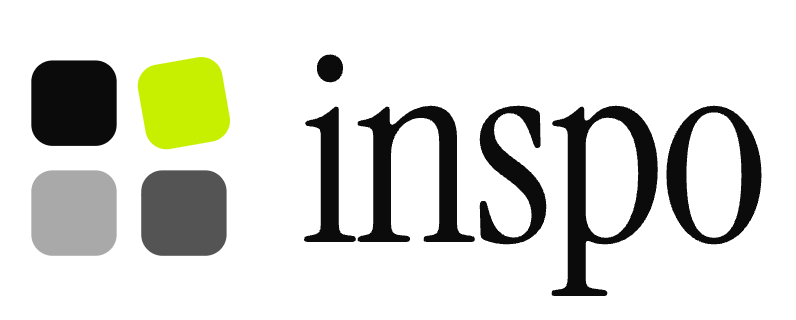
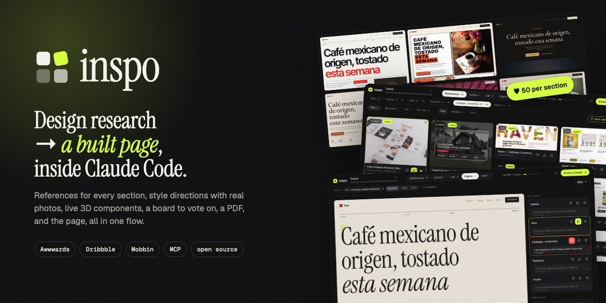
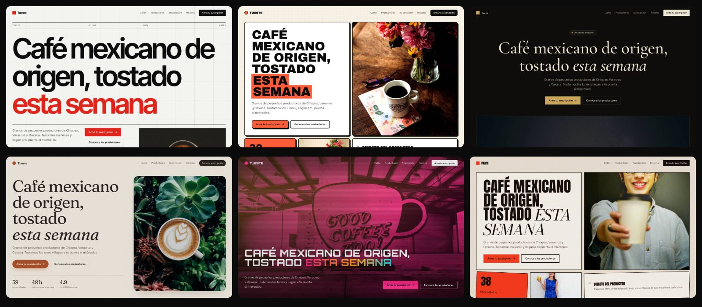
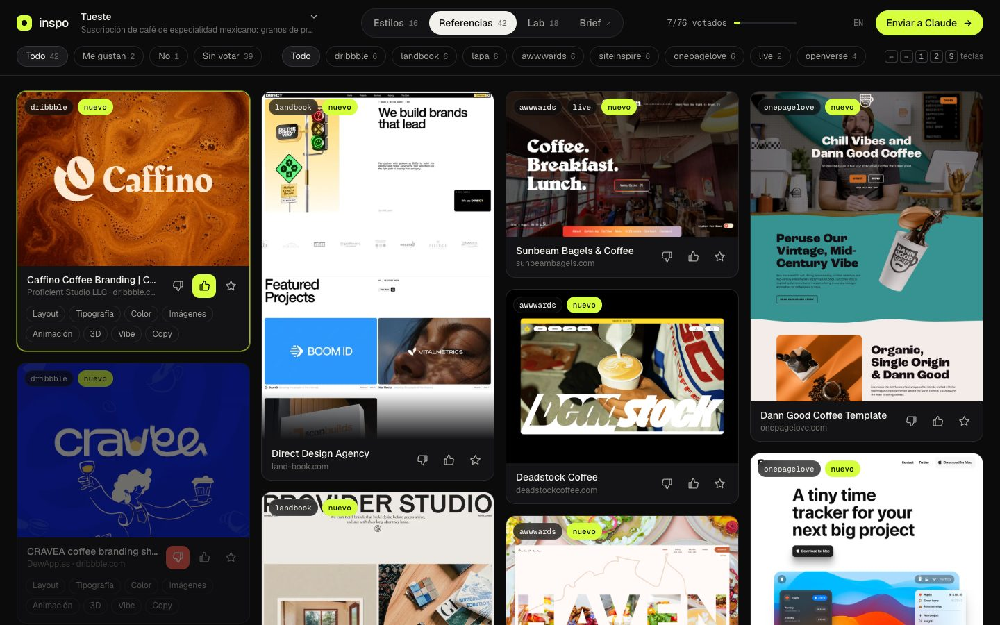
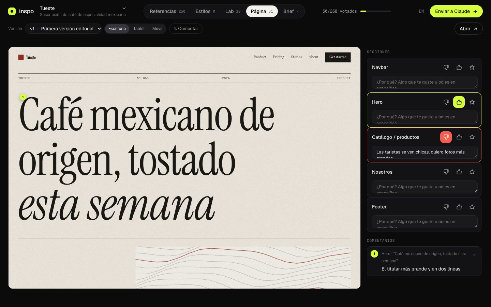
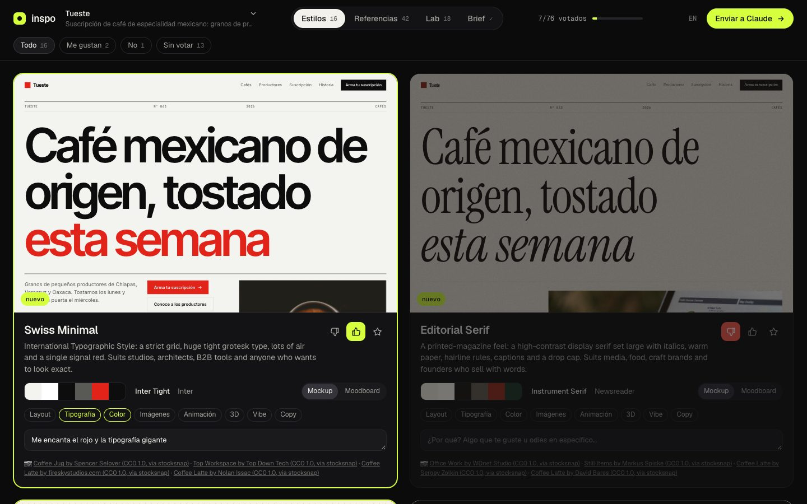
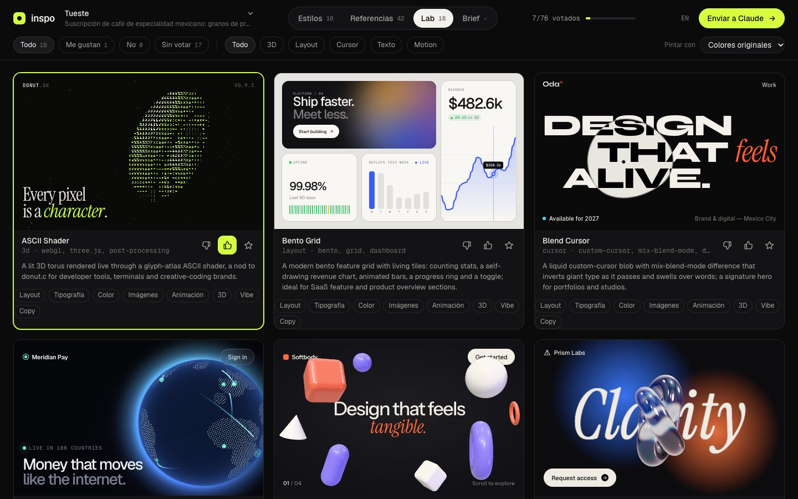
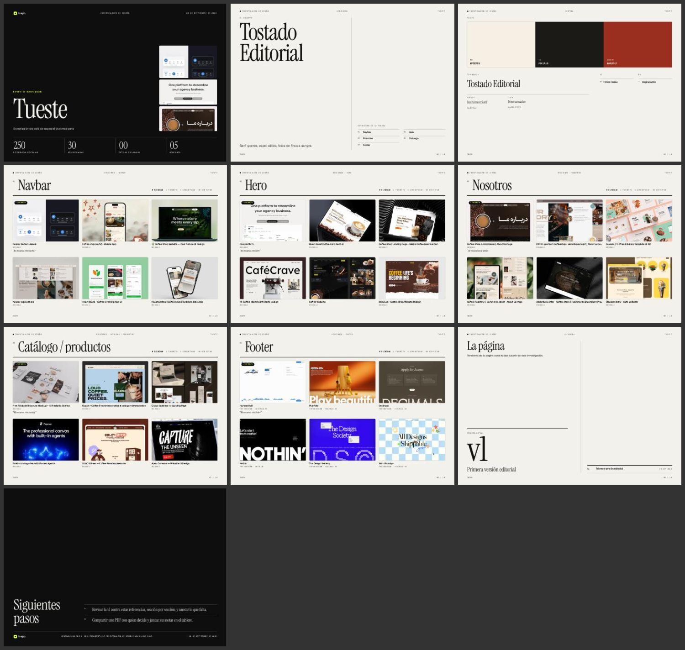

<p align="center">
  <picture>
    <source media="(prefers-color-scheme: dark)" srcset="docs/logo-dark.png">
    
  </picture>
</p>

<p align="center">
  <b>De la idea a la página construida, dentro de Claude Code.</b><br>
  Referencias para cada sección, estilos con fotos reales, componentes 3D en vivo,<br>un tablero para votar, un reporte en PDF y la página misma, ajustada sección por sección.
</p>

<p align="center">
  <a href="#instalación"></a>
  <a href="#herramientas"></a>
  
  <a href="LICENSE"></a>
  <a href="README.md"></a>
</p>

<p align="center"></p>

**Investigación de diseño y construcción de páginas para Claude Code.** Le cuentas tu idea y acuerdan las secciones de la página. Junta unas **50 referencias por sección** (navbar, hero, nosotros, catálogo, footer…) de Awwwards, Dribbble, Siteinspire, footer.design, navbar.gallery y sitios reales premiados que recorta en secciones automáticamente. Dibuja tu página en varios estilos con fotos reales y te abre un tablero donde votas todo, componentes 3D en vivo incluidos. Después te entrega un reporte en PDF, construye la página con lo que elegiste y la ajusta con tu feedback sección por sección.



```
/inspo suscripción de café mexicano de especialidad, tostado cada semana
```

## Qué te da

- **50+ referencias por sección.** Una cosecha en segundo plano llena cada sección que necesites (19 tipos: navbar, hero, logos, features, servicios, catálogo, proyectos, nosotros, proceso, números, equipo, testimonios, precios, FAQ, blog, CTA, newsletter, contacto, footer). Sus fuentes:
  - **Galerías dedicadas:** footer.design y navbar.gallery.
  - **Dribbble.**
  - **Sitios reales recortados en secciones.** Visita cientos de ganadores de Awwwards y Siteinspire, quita banners de cookies y popups de descuento, encuentra cada sección, sigue las ligas a /about, /shop o /pricing cuando la sección tiene su propia página, y captura solo esa parte.

  Unas 250 referencias en 5 secciones tardan como 6 minutos, y el tablero se va llenando en vivo mientras corre.
- **Galerías a la carta.** Awwwards, Dribbble, Land-book, Siteinspire, One Page Love, Lapa Ninja y Mobbin. De los sitios en vivo saca fuentes, paleta, bordes, escala tipográfica y tecnología (three.js, GSAP, Lenis, Webflow, Framer, Spline…).
- **Estilos.** Tu propia landing, con tu copy, en 4–6 direcciones distintas. Cada una trae su paleta, fuentes de Google Fonts, layout, textura, tratamiento de imagen y fotos CC0 reales. Incluye 16 presets, y Claude los ajusta o inventa nuevos.
- **Lab.** 18 componentes en vivo de nivel producción (shaders WebGL, globo de puntos, nudo de vidrio, galaxias de partículas, stacks con scroll, botones magnéticos…), más los que Claude escribe para tu idea. Los puedes repintar todos con un estilo que te gustó.
- **El tablero.** Una página local donde votas 👍 / 👎 / ★ sección por sección, marcas *por qué* (layout, tipografía, color, animación, 3D…), dejas notas y le das **Enviar a Claude**. **⚡ Votar rápido** va una por una con `1` / `2` / `S`. Se guarda solo y está en español o inglés.
- **En cada sección, solo lo que es.** Las tarjetas de galería deben estar etiquetadas con la sección (nada de landings completas ni apps bajo "footer"), y los recortes salen solo de detecciones seguras. Luego Claude revisa cada sección visualmente en hojas de contacto numeradas, quita lo que no va (y ya no vuelve) y rellena. También tienes un botón **✕ No es footer** (tecla `X`).
- **Plan.** Después de votar, Claude analiza tus favoritos y escribe el plan de cada sección: la referencia principal, alternativas y qué se toma de layout, tipografía, color, imágenes y animación, más los componentes. En la pestaña **Plan** cambias la referencia por cualquiera de tus likes o de esa sección, cambias estilo o componentes, dejas notas y apruebas. Claude construye con ese plan.
- **Reporte en PDF.** Un entregable con acabado de estudio: portada, dirección, los ganadores de cada sección con tus notas, estilos, componentes y la página actual.
- **La página.** Claude la construye con tus votos. En la pestaña **Página** ves cada versión en escritorio, tablet y móvil. Votas y dejas notas por sección, o activas **Comentar** y le das clic a lo que quieras para dejar una nota fijada. Claude lee los comentarios, con el elemento exacto, la rehace y publica la v2, v3…
- **Rondas.** Claude lee tus votos, incluidas las miniaturas de lo que te gustó, y hace una segunda ronda más afinada.
- **Brief.** La dirección final: concepto, principios, paleta, tipografía, estructura de la página, componentes, qué sí y qué no, y tokens CSS. Aparece en el tablero y se escribe en `DESIGN.md`.

| Referencias por sección | La página, con feedback por sección y comentarios fijados |
|---|---|
|  |  |
| **Estilos** | **Lab** |
|  |  |



## Instalación

En Claude Code:

```
/plugin marketplace add brunovareliuu/inspo
/plugin install inspo@inspo
```

Eso instala la skill `inspo` (el flujo) y el servidor MCP `inspo` (las herramientas). El servidor instala sus dependencias solo la primera vez que arranca. Usa tu Google Chrome; si no tienes Chrome, corre `npx playwright install chromium`.

Necesitas Node 20 o superior.

<details>
<summary>Otros clientes MCP (Cursor, Claude Desktop, Windsurf…)</summary>

```bash
git clone https://github.com/brunovareliuu/inspo ~/inspo && cd ~/inspo && npm install
```

```json
{
  "mcpServers": {
    "inspo": { "command": "node", "args": ["/ruta/absoluta/a/inspo/src/server.js"] }
  }
}
```

Las herramientas funcionan en cualquier cliente. El flujo vive en [`skills/inspo/SKILL.md`](skills/inspo/SKILL.md); pégalo en las reglas o instrucciones de proyecto de tu cliente.
</details>

## Cómo se usa

Solo describe lo que estás haciendo. La skill se activa sola, o la llamas con `/inspo`:

```
/inspo portafolio para un despacho de arquitectura en Monterrey, muy minimalista
/inspo rediseña esta app, parece plantilla
/inspo landing para mi app de notas con IA, me encantan linear.app y stripe.com
```

La conversación:

1. **La idea.** Claude te dice lo que entendió y pregunta solo lo que falta: público, qué debe transmitir, sitios que te gustan, marca. Si hay repo o app corriendo, los revisa.
2. **Secciones.** Te pregunta qué secciones necesita la página.
3. **Recomendación.** Propone una lista de secciones para tu tipo de página, con el porqué de cada una, y tú la ajustas.
4. **Investigación y votos.** Cosecha de unas 50 referencias por sección, 4–6 estilos y componentes en vivo, todo en el tablero. Votas y le das **Enviar a Claude**. Claude resume lo que elegiste por sección, publica el brief y exporta el **PDF**.
5. **La página.** Claude la construye con tus votos (estilo, referencias por sección, componentes, tu copy) y la publica en la pestaña **Página**.
6. **Ciclo de feedback.** Votas y comentas sección por sección, y Claude la rehace. Se repite hasta que quede, y luego se integra a tu stack.

Todo lo de un proyecto vive en `<proyecto>/.inspo/<sesión>/`, que se ignora en git automáticamente.

## Herramientas

| Herramienta | Qué hace |
|---|---|
| `inspo_start` | Sesión nueva: idea, contexto, copy real y secciones |
| `inspo_sections` | Catálogo de secciones y sets recomendados por tipo de página, o fija el plan |
| `inspo_harvest` | Cosecha en segundo plano de N referencias por sección (50 por defecto) |
| `inspo_status` | Progreso de la cosecha por sección (o cancelarla) |
| `inspo_review` | Hojas de contacto numeradas de una sección para que Claude verifique cada imagen |
| `inspo_plan` | Publica el plan por sección (referencia, alternativas, análisis, componentes) en la pestaña Plan |
| `inspo_search` | Busca en galerías, guarda miniaturas y opcionalmente captura los sitios en vivo |
| `inspo_capture` | Captura y analiza URLs específicas (fuentes, colores, tecnología) |
| `inspo_analyze` | Ve cualquier URL, incluido `localhost`, y regresa captura y ADN de diseño |
| `inspo_add_styles` | Dibuja tu página en direcciones de estilo con fotos reales |
| `inspo_add_component` | Agrega un componente propio al Lab |
| `inspo_add_images` | Agrega un set de imágenes de moodboard (Openverse, con licencia CC) |
| `inspo_open` | Abre el tablero |
| `inspo_feedback` | Votos por sección, estilos, componentes y feedback de la página (votos por sección y comentarios fijados), con miniaturas; puede esperar a **Enviar a Claude** |
| `inspo_add_build` | Publica una versión de la página (html, un archivo o una URL) en la pestaña Página |
| `inspo_export_pdf` | Exporta el reporte de investigación en PDF |
| `inspo_next_round` | Empieza la ronda N |
| `inspo_brief` | Publica la dirección final y la escribe en `DESIGN.md` |
| `inspo_remove` | Quita lo que no va |
| `inspo_catalog` | Lista fuentes, presets y componentes |
| `inspo_login` | Inicia sesión en Mobbin una vez, en una ventana visible |

## Fuentes

| Fuente | Sirve para | Notas |
|---|---|---|
| Awwwards | Sitios premiados con mucha animación | Liga al sitio en vivo |
| Dribbble | Estilos visuales, conceptos de UI, renders 3D | |
| Land-book | Estructura de landings completas | Capturas largas |
| Siteinspire | Tipografía, sobriedad, estudios | Liga al sitio en vivo |
| One Page Love | One-pagers y lanzamientos | |
| Lapa Ninja | Landings de SaaS y startups | |
| Mobbin | Pantallas y flujos reales de apps | Necesita cuenta de Mobbin: `inspo_login` |
| footer.design | Solo footers | Fuente de la cosecha para `footer` |
| Navbar Gallery | Solo navbars | Fuente de la cosecha para `navbar` |
| Sitios en vivo | Todas las secciones, recortadas de sitios reales | Categorías y búsqueda de Awwwards, Siteinspire, Sites of the Day y los sitios que elige Claude |
| Openverse | Fotos para estilos y moodboards | Licencia CC y créditos, sin API key. Prioriza el stock CC0 de StockSnap |

Las galerías cambian su HTML. Si una se rompe, `node bin/inspo.js doctor` te dice cuál, y casi siempre se arregla con un PR de dos líneas en `src/sources/index.js`.

## Estilos incluidos

Swiss Minimal, Editorial Serif, Neo-Brutalist, Dark Luxury, Aurora Glass, Tech Noir, Y2K Chrome, Organic Soft, Synthwave Retro-future, Playful Pop, Terminal Mono, Architectural Monochrome, Wabi-Sabi Zen, Gradient SaaS, Bauhaus Geometric y Magazine Maximalist. Cada uno se puede ajustar (paleta, fuentes, layout, textura, tratamiento de imagen), y Claude también puede pasar HTML totalmente propio. Los detalles están en el [README en inglés](README.md#style-presets).

## Componentes

Liquid Blob, Particle Galaxy, Glass Knot, Wave Terrain, Dot Globe, Gradient Mesh, Floating Shapes, ASCII Shader, Tilt Cards, Spotlight Cards, Magnetic Buttons, Blend Cursor, Editorial Text Reveal, Scramble Text, Noise Editorial Hero, Velocity Marquee, Bento Grid y Sticky Stack Scroll. Cada uno es un solo archivo HTML en [`components/`](components). Cuando eliges uno, Claude lo porta a tu stack (React/Next con R3F, GSAP, Motion…).

## CLI

```bash
node bin/inspo.js serve          # abre el tablero de la última sesión en ./.inspo
node bin/inspo.js sessions       # lista las sesiones
node bin/inspo.js login mobbin   # inicia sesión en Mobbin una vez
node bin/inspo.js doctor         # revisa navegador, red y cada fuente
```

## Uso responsable

inspo es para investigación de diseño privada, como cuando un diseñador guarda capturas en un moodboard. Lee galerías públicas a ritmo humano, guarda las capturas en tu máquina y liga a cada fuente. No redistribuyas el trabajo de otros ni clones sitios: toma los principios, no los pixeles. Las fotos de Openverse conservan sus créditos de licencia; para producción, contrata o licencia fotografía propia. Respeta los términos de cada sitio: Mobbin en particular requiere tu propia cuenta.

## Desarrollo

```bash
npm install
npm test          # tests unitarios sin red
npm run e2e       # maneja el servidor MCP real de punta a punta (necesita red y Chrome)
```

Los PRs son bienvenidos, sobre todo nuevas fuentes, estilos y componentes para el Lab.

## Licencia

MIT © Bruno Varela
