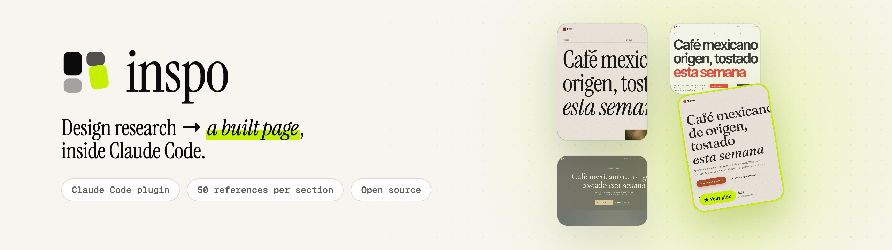
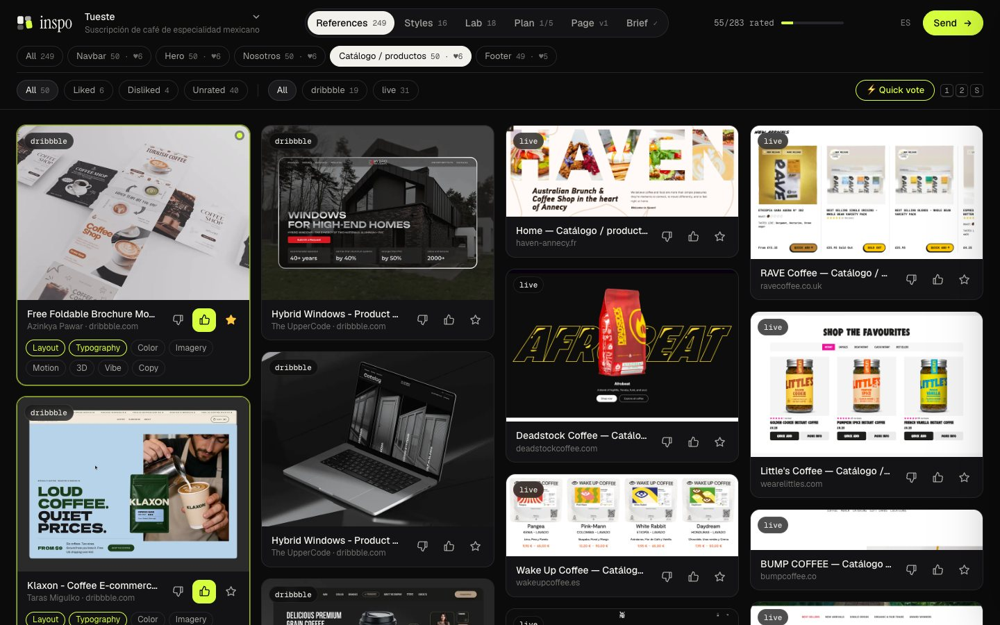
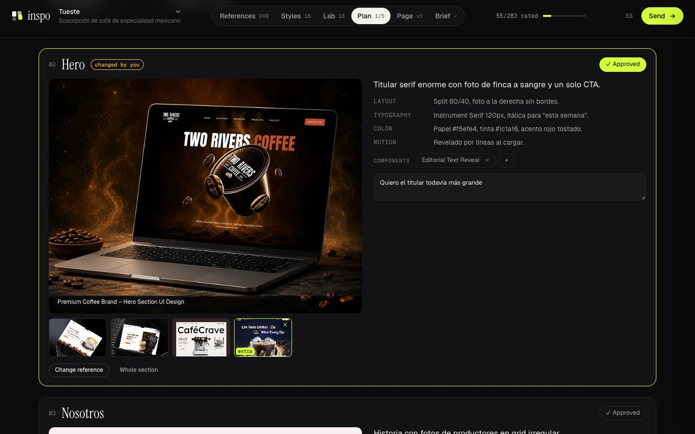
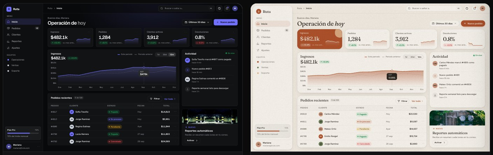
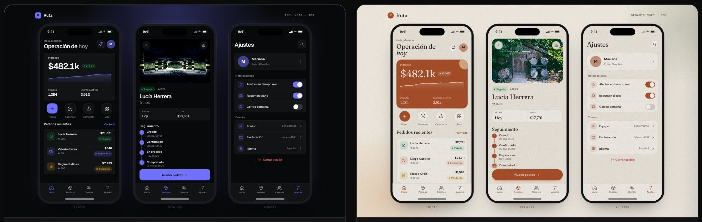
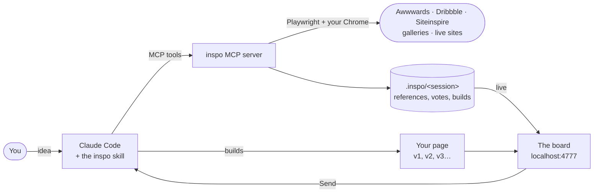

<div align="center">

**English** · [Español](README.es.md)

<picture>
  <source media="(prefers-color-scheme: dark)" srcset="docs/banner-dark.png">
  
</picture>

<br>

**Tell Claude your idea. inspo gathers about 50 references for every section of your page,
renders it in several styles with real photos, opens a board where you vote on all of it, and
then builds the page.**<br>
For websites, web systems and mobile apps. Open source, and it runs on your machine.

<br>

[](https://github.com/brunovareliuu/inspo/actions/workflows/ci.yml)
[](LICENSE)
[](#install)
[](#tools)
[](package.json)
[](https://playwright.dev)

[**Install in 30 seconds**](#install) · [Use it](#use-it) · [What it does](#what-it-does) · [Tools](#tools) · [How it's built](#how-its-built) · [Contributing](CONTRIBUTING.md)

<br>


</div>

## Why inspo

<table>
<tr>
<td width="50%" valign="top">

**References from your industry.** A restaurant gets food. About 40 of every 50 references
come from your industry, and the other 10 come from anywhere, for ideas you wouldn't have
looked for.

</td>
<td width="50%" valign="top">

**Real sites, cut into sections.** It visits award-winning sites, closes the cookie banners,
finds the hero, the catalog or the footer, and screenshots just that part. You compare footers
with footers.

</td>
</tr>
<tr>
<td valign="top">

**You vote instead of describing.** 👍, 👎 or ★ on every reference, style and component, plus
*why* (layout, type, color, motion…). Claude reads the votes and the images you liked.

</td>
<td valign="top">

**It ends in a page.** Claude builds the page from your votes, and you keep commenting section
by section until it's right. v1, v2, v3… all on the same board.

</td>
</tr>
</table>

```
/inspo a subscription for Mexican specialty coffee, roasted weekly
```

## What it does

<table>
<tr>
<td colspan="2" valign="top">

### 50+ references per section
A background harvest fills every section you need (19 types: navbar, hero, logos, features,
services, catalog, work, about, process, stats, team, testimonials, pricing, FAQ, blog, CTA,
newsletter, contact, footer) from **dedicated galleries** (footer.design, navbar.gallery),
**Dribbble**, and **real sites cut into sections**: it visits hundreds of Awwwards and
Siteinspire winners, removes cookie banners and discount popups, and follows links to /about,
/shop and /pricing when a section has its own page. Around 250 references across 5 sections
take about 6 minutes, and the board fills live while it runs.



</td>
</tr>
<tr>
<td width="50%" valign="top">

### Styles
Your own landing page, with your copy, in 4–6 distinct directions. Each one gets its own
palette, Google Fonts, layout, texture and real CC0 photos. 16 presets included, and Claude
can tune them or invent new ones.


</td>
<td width="50%" valign="top">

### Lab
18 live, production-grade components (WebGL shaders, a dot globe, a glass knot, particle
galaxies, sticky stacks, magnetic buttons…) plus custom ones Claude writes for your idea.
Re-tint all of them with a style you liked.


</td>
</tr>
<tr>
<td colspan="2" valign="top">

### Plan
After you vote, Claude analyzes your favorites and writes the plan for each section: the
leading reference, alternates, and what to take for layout, type, color, imagery and motion,
plus the components. You swap the reference for any of your likes, change the style, leave
notes and approve. Claude builds from that plan.



</td>
</tr>
<tr>
<td colspan="2" valign="top">

### The page
Claude builds it from your votes and publishes it to the **Page** tab, in desktop, tablet and
mobile. Vote and note each section, or switch on **Comment** and click anything to pin a note.
Any comment can carry a reference (one of your saved images or an upload) and an action:
*tweak*, *replace this section with the reference*, *add above* or *add below*. Claude sees
the images, applies each action, and publishes v2, v3…


</td>
</tr>
<tr>
<td width="50%" valign="top">

### PDF report
A studio-style deliverable: cover, direction, the winners of every section with your notes,
styles, components, and the current page.


</td>
<td width="50%" valign="top">

### The board
👍 / 👎 / ★ section by section, *why* tags, notes, and **Send**. **⚡ Quick vote** goes one by
one with `1` / `2` / `S`, and **✕ Not a footer** (key `X`) removes a misfit for good. It
autosaves and runs in English or Spanish.

Claude also checks every section on numbered contact sheets, removes what doesn't belong and
refills, so each section only holds that section.

</td>
</tr>
</table>

### Websites, web systems and apps

inspo adapts to what you're making:

| You're making | It researches | Styles render as | Claude builds |
|---|---|---|---|
| **Website** (landing, store, portfolio) | Page sections: navbar, hero, about, catalog, pricing, testimonials, footer… | Your landing page | A responsive page |
| **Web system** (SaaS, dashboard, admin, internal tool) | App screens: login, onboarding, dashboard, sidebar, tables, detail, forms, settings, billing, empty states… | A dashboard with your data | A clickable prototype |
| **Mobile app** (iOS / Android) | App screens: onboarding, login, home, tab bar, feed, detail, search, profile, checkout… | Three phone screens | Phone-size screens |




App screens come from SaaS Interface (real products like Grafana, Ahrefs, Mixpanel, Qonto),
Dribbble filtered by platform (no mobile shots in a web system, and the other way around), and
Mobbin when you log in once.

## Install

In Claude Code:

```
/plugin marketplace add brunovareliuu/inspo
/plugin install inspo@inspo
```

That installs the `inspo` skill (the workflow) and the `inspo` MCP server (the tools). The server installs its own dependencies the first time it starts. It uses your installed Google Chrome; with no Chrome, run `npx playwright install chromium`.

Requires Node 20+.

<details>
<summary>Other MCP clients (Cursor, Claude Desktop, Windsurf…)</summary>

```bash
git clone https://github.com/brunovareliuu/inspo ~/inspo && cd ~/inspo && npm install
```

```json
{
  "mcpServers": {
    "inspo": { "command": "node", "args": ["/absolute/path/to/inspo/src/server.js"] }
  }
}
```

The tools work in any client. The workflow lives in [`skills/inspo/SKILL.md`](skills/inspo/SKILL.md); paste it into your client's rules or project instructions.
</details>

## Use it

Just describe what you're making. The skill triggers on its own, or you can call it with `/inspo`:

```
/inspo portfolio for an architecture studio in Monterrey, very minimal
/inspo redesign this app — it looks like a template
/inspo landing for my AI note-taking app, I love linear.app and stripe.com
```

The conversation:

1. **The idea.** Claude reflects back what it understood and asks only what's missing: audience, the feeling, sites you love, brand assets. If there's a repo or running app, it looks at it.
2. **Sections.** It asks which sections the page needs.
3. **Recommendation.** It proposes a section list for your kind of page, one line of *why* each, and you adjust it.
4. **Research and votes.** A harvest of about 50 references per section, 4–6 style directions and live components, all on the board. You vote and hit **Send**. Claude summarizes what you picked per section, publishes the brief, and exports the **PDF**.
5. **The page.** Claude builds it from your votes (style, per-section references, components, your copy) and publishes it to the **Page** tab.
6. **Feedback loop.** You vote and comment section by section, and Claude rebuilds. Repeat until it's right, then integrate it into your stack.

Everything for a project lives in `<project>/.inspo/<session>/`, which is git-ignored automatically.

## Tools

| Tool | What it does |
|---|---|
| `inspo_start` | New session: idea, context, real draft copy, and sections |
| `inspo_sections` | Section catalog and recommended sets per page type, or set the plan |
| `inspo_harvest` | Background harvest of N references per section (default 50) |
| `inspo_status` | Harvest progress per section (or cancel) |
| `inspo_review` | Numbered contact sheets of a section, so Claude can verify every item visually |
| `inspo_plan` | Publish the per-section plan (reference, alternates, analysis, components) to the Plan tab |
| `inspo_search` | Search galleries (optionally for one section), save thumbnails, optionally capture the live sites |
| `inspo_capture` | Screenshot and analyze specific URLs (fonts, colors, tech) |
| `inspo_analyze` | Look at any URL, including `localhost`, and return a screenshot plus its design DNA |
| `inspo_add_styles` | Render your page in style directions with real photos |
| `inspo_add_component` | Add a custom live component to the Lab |
| `inspo_add_images` | Add a moodboard image set (Openverse, CC-licensed) |
| `inspo_open` | Open the board |
| `inspo_feedback` | Votes per section, styles, components, and page feedback (section votes and pinned comments), with thumbnails; can wait for **Send** |
| `inspo_add_build` | Publish a page version (html, a file, or a URL) to the Page tab |
| `inspo_export_pdf` | Export the research report as a PDF |
| `inspo_next_round` | Start round N |
| `inspo_brief` | Publish the final direction, written to `DESIGN.md` |
| `inspo_remove` | Drop off-brief items |
| `inspo_catalog` | List sources, presets and components |
| `inspo_login` | Log in to Mobbin once, in a visible browser window |

## Sources

| Source | Good for | Notes |
|---|---|---|
| Awwwards | Crafted, motion-heavy sites | Links to live site |
| Dribbble | Visual styles, UI concepts, 3D renders | |
| Land-book | Full-page landing structure | Tall screenshots |
| Siteinspire | Typography, restraint, studios | Links to live site |
| One Page Love | One-pagers, launches | |
| Lapa Ninja | SaaS / startup landings | |
| Mobbin | Real app screens and flows | Needs a Mobbin account: `inspo_login` |
| SaaS Interface | Real SaaS screens by type (dashboard, tables, settings, sign-in…) | Harvest source for web app screens |
| maxibestof | Website sections by type (hero, header, features, testimonials, FAQ, footer…) | Harvest source for page sections |
| Collect UI | 150+ UI categories (dashboard, sign up, checkout, settings, pricing, footer…) | Harvest source for sections and screens, web and mobile |
| Nicelydone | Real SaaS screens (sign up, onboarding, dashboard, tables, billing…) | Harvest source for web app screens |
| CSS Design Awards · Web Design Inspiration · Dark Mode Design | Award-winning and curated live sites | Feed the live-site crawl |
| Behance | Product UI and branding case studies | On demand with `inspo_search` |
| footer.design | Footers only | Harvest source for `footer` |
| Navbar Gallery | Navigation bars only | Harvest source for `navbar` |
| Live sites | Every section, cut from real sites | Awwwards categories and search, Siteinspire, Sites of the Day, plus sites Claude picks |
| Openverse | Photos for styles and moodboards | CC-licensed, credited, no API key. Prefers StockSnap's CC0 stock |

Galleries change their markup. If one breaks, `node bin/inspo.js doctor` tells you which, and a PR to `src/sources/index.js` is usually a two-line fix.

## Style presets

| Style | Vibe | Type | Hero |
|---|---|---|---|
| Swiss Minimal | precise, rational, confident | Inter Tight / Inter | poster |
| Editorial Serif | literate, calm, authoritative | Instrument Serif / Newsreader | editorial |
| Neo-Brutalist | loud, honest, energetic | Archivo Black / Space Grotesk | bento |
| Dark Luxury | opulent, hushed, exclusive | Cormorant Garamond / Manrope | centered |
| Aurora Glass | dreamy, luminous, futuristic | Sora / Outfit | centered |
| Tech Noir | focused, precise, nocturnal | Geist | centered |
| Y2K Chrome | shiny, nostalgic, hyper | Unbounded / Hanken Grotesk | poster |
| Organic Soft | warm, gentle, grounded | Fraunces / DM Sans | split |
| Synthwave Retro-future | nostalgic, electric, cinematic | Orbitron / Exo 2 | full-bleed |
| Playful Pop | cheerful, bouncy, friendly | Bricolage Grotesque / Figtree | bento |
| Terminal Mono | raw, technical, hacker-honest | JetBrains Mono / IBM Plex Mono | split |
| Architectural Monochrome | austere, monumental, exacting | Archivo | full-bleed |
| Wabi-Sabi Zen | quiet, imperfect, meditative | Shippori Mincho / Zen Kaku Gothic New | editorial |
| Gradient SaaS | optimistic, polished, trustworthy | Plus Jakarta Sans | split |
| Bauhaus Geometric | constructive, bold, primary | Jost | poster |
| Magazine Maximalist | loud, eclectic, collage-rich | Anton / Libre Franklin / Bodoni Moda | bento |

Every preset can be overridden (palette, fonts, layout, texture, image treatment), and Claude can pass fully custom specimen HTML.

## Component library

| Component | Category | |
|---|---|---|
| Liquid Blob | 3D | Noise-displaced iridescent sphere that leans toward the cursor |
| Particle Galaxy | 3D | 40k additive particles in a slow spiral |
| Glass Knot | 3D | Dispersive glass torus knot refracting giant type |
| Wave Terrain | 3D | Retro-futurist wireframe valley under a striped sun |
| Dot Globe | 3D | Dotted Earth with arcs between cities |
| Gradient Mesh | 3D | Stripe-style flowing gradient with grain |
| Floating Shapes | 3D | Glossy primitives drifting around a headline |
| ASCII Shader | 3D | A lit torus through a glyph-atlas ASCII shader |
| Tilt Cards | cursor | Perspective tilt with glare |
| Spotlight Cards | cursor | Linear-style cursor spotlight and glowing borders |
| Magnetic Buttons | cursor | Magnetic pull and fill-from-entry hovers |
| Blend Cursor | cursor | Liquid blob cursor inverting giant type |
| Editorial Text Reveal | text | Masked, staggered line reveals |
| Scramble Text | text | Decoding glyph effect |
| Noise Editorial Hero | text | Magazine cover with grain and a parallax plate |
| Velocity Marquee | motion | Giant marquees that skew with scroll velocity |
| Bento Grid | layout | Living tiles: counters, chart, bars |
| Sticky Stack Scroll | layout | Cards that pin and stack like folder tabs |

Each one is a single self-contained HTML file in [`components/`](components). They read `--bg --fg --muted --accent --accent2` from the URL, so the board can re-tint them with any style. When you pick one, Claude ports it to your stack (React/Next with R3F, GSAP, Motion…). [`skills/inspo/references/components.md`](skills/inspo/references/components.md) has the conventions.

## CLI

```bash
node bin/inspo.js serve          # open the board for the latest session in ./.inspo
node bin/inspo.js sessions       # list sessions
node bin/inspo.js login mobbin   # log in to Mobbin once
node bin/inspo.js doctor         # check browser, network and every source
```

## Config

| Env var | Default | |
|---|---|---|
| `INSPO_DIR` | `<cwd>/.inspo` | Where sessions live |
| `INSPO_PORT` | `4777` | Board port (next free port if taken) |
| `INSPO_HOME` | `~/.inspo` | Persistent browser profile (Mobbin login) |

## How it's built



- **One local server.** The MCP server gives Claude the tools and serves the board on
  `localhost`. Nothing leaves your machine except the page visits it makes to research.
- **Your Chrome, driven by Playwright.** It reads galleries, crops live sites into sections and
  renders the PDF.
- **Files you can read.** Every session is a folder in `<project>/.inspo/` with the
  references, your votes (`feedback.json`), the page versions and `DESIGN.md`.

| Piece | Built with |
|---|---|
| Tools | [MCP TypeScript SDK](https://github.com/modelcontextprotocol/typescript-sdk) · Node 20+ · zod |
| Browser | [Playwright](https://playwright.dev) with your installed Chrome |
| Board | One HTML file, no build step |
| Lab | Self-contained HTML components (three.js, GSAP, WebGL) |
| PDF | Rendered by Chrome |
| Photos | [Openverse](https://openverse.org), CC-licensed and credited |

## Responsible use

inspo is for private design research, like a designer saving screenshots to a moodboard. It reads public gallery pages at human pace, stores screenshots locally, and links back to every source. Don't redistribute other people's work, and don't clone a site. Take the principles, not the pixels. Openverse photos keep their license credits; for production, commission or license proper photography. Respect each site's terms: Mobbin in particular requires your own account.

## Development

```bash
npm install
npm test          # offline unit tests
npm run e2e       # drives the real MCP server end to end (needs network + Chrome)
node bin/inspo.js doctor# checks every scraper
```

Layout:

```
src/server.js          MCP server (tools)
src/sources/           gallery scrapers
src/capture.js         live screenshots, design-DNA analysis, Openverse images
src/styles/            style presets + specimen renderer
src/board/             local board (server + single-file UI)
components/            live component library
skills/inspo/          the Claude Code skill (workflow + playbooks)
.claude-plugin/        plugin + marketplace manifests
```

## Contributing

PRs are welcome, especially new sources, style presets and Lab components. Start with
[CONTRIBUTING.md](CONTRIBUTING.md); questions go to
[Discussions](https://github.com/brunovareliuu/inspo/discussions), and security issues to a
[private report](https://github.com/brunovareliuu/inspo/security/advisories/new).

## License

MIT © Bruno Varela
