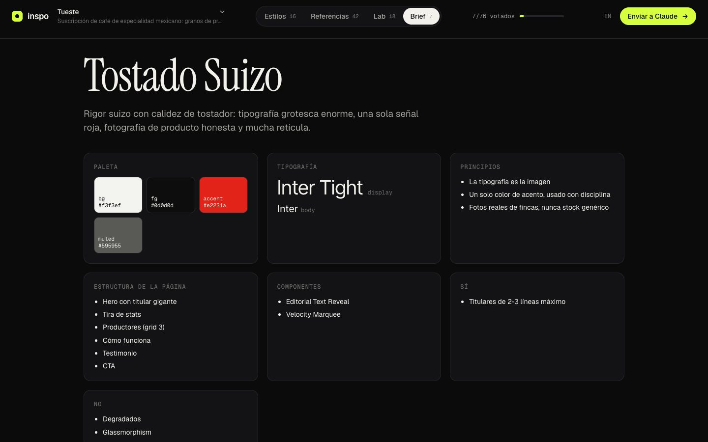

# inspo

**Design research for Claude Code.** Give it an idea. It studies your app, pulls references from Awwwards, Dribbble, Mobbin, Land-book and more, screenshots live sites, renders your landing page in a range of visual styles with real photos, and opens a board where you vote on all of it, 3D components included. Then it learns your taste and converges on a design direction you actually like.

[Español](README.es.md)


```
/inspo a subscription for Mexican specialty coffee, roasted weekly
```

## What you get

- **References.** Awwwards, Dribbble, Land-book, Siteinspire, One Page Love, Lapa Ninja and Mobbin, scraped with a real browser. Live sites are screenshotted (hero and full page) and analyzed: fonts, color palette, radii, type scale, and what they're built with (three.js, GSAP, Lenis, Webflow, Framer, Spline…).
- **Styles.** Your own landing page, with your copy, rendered in 4–6 distinct directions. Each one gets its own palette, Google Fonts, layout, texture and image treatment, and real CC0 photos. 16 presets included, and Claude can tune them or invent new ones.
- **Lab.** 18 live, production-grade components (WebGL shaders, a dot globe, a glass knot, particle galaxies, sticky stacks, magnetic buttons…), plus custom ones Claude writes for your idea. You can re-tint all of them with a style you liked.
- **The board.** A local page where you 👍 / 👎 / ★, tag *why* (layout, type, color, motion, 3D…), write notes, and hit **Send to Claude**. It has keyboard shortcuts, autosaves, and runs in English or Spanish.
- **Rounds.** Claude reads your votes, including the thumbnails you liked, and runs a sharper second round.
- **Brief.** The final direction: concept, principles, palette, type, page outline, components, do/don't, and CSS tokens. It shows on the board and is written to `DESIGN.md`.

| Styles | References |
|---|---|
|  |  |
| **Lab** | **Brief** |
|  |  |

## Install

In Claude Code:

```
/plugin marketplace add brunovareliuu/inspo
/plugin install inspo@inspo
```

That installs the `inspo` skill (the workflow) and the `inspo` MCP server (the tools). The server installs its own dependencies the first time it starts. It uses your installed Google Chrome; with no Chrome, run `npx playwright install chromium`.

Requires Node 20+.

<details>
<summary>Other MCP clients (Cursor, Claude Desktop, Windsurf…)</summary>

```bash
git clone https://github.com/brunovareliuu/inspo ~/inspo && cd ~/inspo && npm install
```

```json
{
  "mcpServers": {
    "inspo": { "command": "node", "args": ["/absolute/path/to/inspo/src/server.js"] }
  }
}
```

The tools work in any client. The workflow lives in [`skills/inspo/SKILL.md`](skills/inspo/SKILL.md); paste it into your client's rules or project instructions.
</details>

## Use it

Just describe what you're making. The skill triggers on its own, or you can call it with `/inspo`:

```
/inspo portfolio for an architecture studio in Monterrey, very minimal
/inspo redesign this app — it looks like a template
/inspo landing for my AI note-taking app, I love linear.app and stripe.com
```

The loop:

1. **Understand.** Claude reads the idea, and your codebase if there is one (Tailwind config, CSS variables, layouts), or looks at your running app.
2. **Research.** Gallery searches, live captures of best-in-class sites, 4–6 style directions, and components.
3. **Vote.** The board opens in your browser. Vote, tag reasons, write notes, then hit **Send to Claude**.
4. **Converge.** Claude tells you what it learned about your taste and runs a narrower round 2.
5. **Direction.** Claude publishes the brief and `DESIGN.md`, then offers to build it in your stack.

Everything for a project lives in `<project>/.inspo/<session>/`, which is git-ignored automatically.

## Tools

| Tool | What it does |
|---|---|
| `inspo_start` | New session: idea, context, and real draft copy |
| `inspo_search` | Search galleries, save thumbnails, optionally capture the live sites |
| `inspo_capture` | Screenshot and analyze specific URLs (fonts, colors, tech) |
| `inspo_analyze` | Look at any URL, including `localhost`, and return a screenshot plus its design DNA |
| `inspo_add_styles` | Render your page in style directions with real photos |
| `inspo_add_component` | Add a custom live component to the Lab |
| `inspo_add_images` | Add a moodboard image set (Openverse, CC-licensed) |
| `inspo_open` | Open the board |
| `inspo_feedback` | Read votes, reasons, notes and patterns; can wait for **Send to Claude** |
| `inspo_next_round` | Start round N |
| `inspo_brief` | Publish the final direction, written to `DESIGN.md` |
| `inspo_remove` | Drop off-brief items |
| `inspo_catalog` | List sources, presets and components |
| `inspo_login` | Log in to Mobbin once, in a visible browser window |

## Sources

| Source | Good for | Notes |
|---|---|---|
| Awwwards | Crafted, motion-heavy sites | Links to live site |
| Dribbble | Visual styles, UI concepts, 3D renders | |
| Land-book | Full-page landing structure | Tall screenshots |
| Siteinspire | Typography, restraint, studios | Links to live site |
| One Page Love | One-pagers, launches | |
| Lapa Ninja | SaaS / startup landings | |
| Mobbin | Real app screens and flows | Needs a Mobbin account: `inspo_login` |
| Openverse | Photos for styles and moodboards | CC-licensed, credited, no API key. Prefers StockSnap's CC0 stock |

Galleries change their markup. If one breaks, `node bin/inspo.js doctor` tells you which, and a PR to `src/sources/index.js` is usually a two-line fix.

## Style presets

| Style | Vibe | Type | Hero |
|---|---|---|---|
| Swiss Minimal | precise, rational, confident | Inter Tight / Inter | poster |
| Editorial Serif | literate, calm, authoritative | Instrument Serif / Newsreader | editorial |
| Neo-Brutalist | loud, honest, energetic | Archivo Black / Space Grotesk | bento |
| Dark Luxury | opulent, hushed, exclusive | Cormorant Garamond / Manrope | centered |
| Aurora Glass | dreamy, luminous, futuristic | Sora / Outfit | centered |
| Tech Noir | focused, precise, nocturnal | Geist | centered |
| Y2K Chrome | shiny, nostalgic, hyper | Unbounded / Hanken Grotesk | poster |
| Organic Soft | warm, gentle, grounded | Fraunces / DM Sans | split |
| Synthwave Retro-future | nostalgic, electric, cinematic | Orbitron / Exo 2 | full-bleed |
| Playful Pop | cheerful, bouncy, friendly | Bricolage Grotesque / Figtree | bento |
| Terminal Mono | raw, technical, hacker-honest | JetBrains Mono / IBM Plex Mono | split |
| Architectural Monochrome | austere, monumental, exacting | Archivo | full-bleed |
| Wabi-Sabi Zen | quiet, imperfect, meditative | Shippori Mincho / Zen Kaku Gothic New | editorial |
| Gradient SaaS | optimistic, polished, trustworthy | Plus Jakarta Sans | split |
| Bauhaus Geometric | constructive, bold, primary | Jost | poster |
| Magazine Maximalist | loud, eclectic, collage-rich | Anton / Libre Franklin / Bodoni Moda | bento |

Every preset can be overridden (palette, fonts, layout, texture, image treatment), and Claude can pass fully custom specimen HTML.

## Component library

| Component | Category | |
|---|---|---|
| Liquid Blob | 3D | Noise-displaced iridescent sphere that leans toward the cursor |
| Particle Galaxy | 3D | 40k additive particles in a slow spiral |
| Glass Knot | 3D | Dispersive glass torus knot refracting giant type |
| Wave Terrain | 3D | Retro-futurist wireframe valley under a striped sun |
| Dot Globe | 3D | Dotted Earth with arcs between cities |
| Gradient Mesh | 3D | Stripe-style flowing gradient with grain |
| Floating Shapes | 3D | Glossy primitives drifting around a headline |
| ASCII Shader | 3D | A lit torus through a glyph-atlas ASCII shader |
| Tilt Cards | cursor | Perspective tilt with glare |
| Spotlight Cards | cursor | Linear-style cursor spotlight and glowing borders |
| Magnetic Buttons | cursor | Magnetic pull and fill-from-entry hovers |
| Blend Cursor | cursor | Liquid blob cursor inverting giant type |
| Editorial Text Reveal | text | Masked, staggered line reveals |
| Scramble Text | text | Decoding glyph effect |
| Noise Editorial Hero | text | Magazine cover with grain and a parallax plate |
| Velocity Marquee | motion | Giant marquees that skew with scroll velocity |
| Bento Grid | layout | Living tiles: counters, chart, bars |
| Sticky Stack Scroll | layout | Cards that pin and stack like folder tabs |

Each one is a single self-contained HTML file in [`components/`](components). They read `--bg --fg --muted --accent --accent2` from the URL, so the board can re-tint them with any style. When you pick one, Claude ports it to your stack (React/Next with R3F, GSAP, Motion…). [`skills/inspo/references/components.md`](skills/inspo/references/components.md) has the conventions.

## CLI

```bash
node bin/inspo.js serve          # open the board for the latest session in ./.inspo
node bin/inspo.js sessions       # list sessions
node bin/inspo.js login mobbin   # log in to Mobbin once
node bin/inspo.js doctor         # check browser, network and every source
```

## Config

| Env var | Default | |
|---|---|---|
| `INSPO_DIR` | `<cwd>/.inspo` | Where sessions live |
| `INSPO_PORT` | `4777` | Board port (next free port if taken) |
| `INSPO_HOME` | `~/.inspo` | Persistent browser profile (Mobbin login) |

## Responsible use

inspo is for private design research, like a designer saving screenshots to a moodboard. It reads public gallery pages at human pace, stores screenshots locally, and links back to every source. Don't redistribute other people's work, and don't clone a site. Take the principles, not the pixels. Openverse photos keep their license credits; for production, commission or license proper photography. Respect each site's terms: Mobbin in particular requires your own account.

## Development

```bash
npm install
npm test          # offline unit tests
npm run e2e       # drives the real MCP server end to end (needs network + Chrome)
node bin/inspo.js doctor# checks every scraper
```

Layout:

```
src/server.js          MCP server (tools)
src/sources/           gallery scrapers
src/capture.js         live screenshots, design-DNA analysis, Openverse images
src/styles/            style presets + specimen renderer
src/board/             local board (server + single-file UI)
components/            live component library
skills/inspo/          the Claude Code skill (workflow + playbooks)
.claude-plugin/        plugin + marketplace manifests
```

PRs are welcome, especially new sources, style presets and Lab components.

## License

MIT © Bruno Varela
